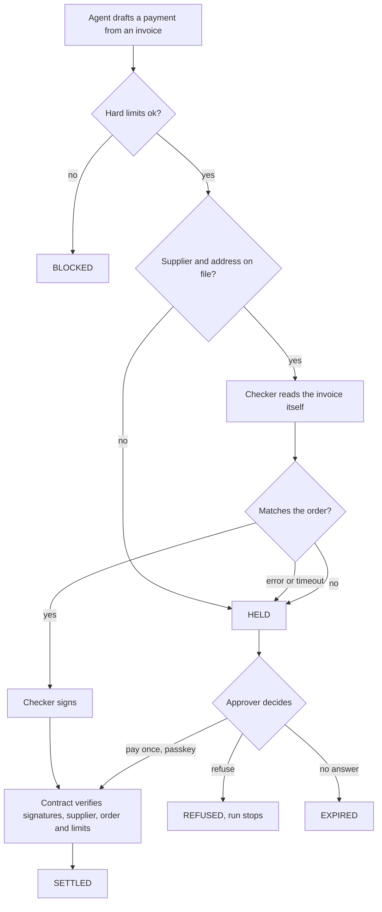

# Countersign Architecture v3

**Status: v3.9, 7 Oct 2026.** v3.9: the MCP server moves to Vercel (`mcp-handler`), and the test agent uses the Vercel AI SDK; Railway keeps the always-running gateway, checker and Postgres.

**v3.8, 7 Oct 2026.** v3.8 carries the Slice 3 and 4 research forward: Monad's real gas and pool rules, MCP's new protocol and SDK v2, pause-and-ask only in Claude Code and Codex, WhatsApp's 24-hour rule.

**v3.7, 7 Oct 2026.** (Afshal: "go ahead"): Spike 4 tests one Countersign connector from Grok, Claude Code, Codex and Muse, plus an OpenRouter test agent (D30); held payments can also reach the person on WhatsApp (D31).

**v3.6, 7 Oct 2026.** every slice file is checked against all earlier slices, and each slice's findings are carried forward into later slices and this file.

**v3.5, 6 Oct 2026.** Nothing is cut for time; all 23 slices are in the entry.

**v3.4, 6 Oct 2026.** Locks the scope (D9, Afshal: "yup").

**Scope (locked 6 Oct):** Countersign checks every payment a business's AI agent makes in stablecoins (supplier invoices, online orders, paid services) against what the business approved. Clear ones go out; the rest wait for a person. The user is a business. Consumer card shopping is out (we could only warn). Invoices are the main example and the benchmark; online orders are shown too; x402 paid services are a stretch goal.

**v3.3, 6 Oct 2026.** Adds D27–D29 from the verified agent-loss cases (Freysa, AIXBT, Lobstar Wilde, Grok and Bankrbot): the model can only hold, a waiting period for new or changed addresses, and a lower cap on first payments to a new address. Design rule: never try to out-think the attacker; keep the rules where no message can reach them.

**v3.2, 6 Oct 2026.** Adds what makes Countersign defensible (D26) and corrects two overclaims in v3.1: what Countersign itself can do with a customer's money, and where a passkey lives.

**v3.1, 6 Oct 2026.** Adds D21–D25: evidence that expires and is re-checked, cross-account isolation, a stop button, where data goes, and pitch hygiene.

**v3, 6 Oct 2026.** v2 approved on 5 Oct (D1–D13). Slice 0 done; Slice 1 spike built, a Mac passkey verified on testnet, phones next. **v3 adds** (Afshal, 6 Oct): stablecoins explained in plain terms, three ways any agent reaches Countersign, what changes when hundreds of invoices arrive at once, phone-first approvals, and the web app's screens. Decisions D14–D20.

**What changed from v1 (same day):** the scope now starts from a user pain, paying the wrong party. The agent pays supplier invoices, not paid articles. "What the user asked for" is now a document, the approved purchase order. x402 purchases left the core. The reasoning and the market numbers are in `13-pain-and-market-sizing.md` (research workspace).

**Revised later on 2 Oct, to stay agent-native:** the agent also does the setup (it proposes suppliers and orders; the person only signs), the demo is led by an agent people already use (Grok, with Claude as the fallback), and the first users are small teams that already hand their inbox to an agent. A spike now tests the Grok connector before anything else is built.

**Revised again on 2 Oct:** B2B payments, sold self-serve. First users narrowed to small teams that pay overseas contractors and suppliers, where stablecoin invoices already exist. Setup happens only in the chat; the app does approvals and the live feed. The advice-only check for bank invoices is now must-ship.

**Revised once more on 2 Oct:** built around what companies care about at scale: speed, no mistakes, ease of use. Parallel execution is now a requirement. Each approved order gets its own vault, so payments against different orders run side by side. The account-wide daily limit is dropped, because a shared counter would undo that.

## The Pain

The person who pays a company's bills checks each invoice by hand against what was agreed. One changed payment detail or one look-alike address sends the money to a fraudster, and it does not come back.

- Business email compromise, the category that covers altered invoices and redirected payments, cost **$3.05 billion** across 24,768 complaints in the FBI's 2025 report.
- One stablecoin holder lost **$50 million** by copying a look-alike address.
- An AI agent that reads emailed invoices and prepares payments is exposed to the same trick, at machine speed, and can be hijacked by text hidden in the invoice.

## Who It Is For First

**The model: B2B payments, sold self-serve.** The payer is a business and the payee is its supplier. A small team adds Countersign to its agent with one link; there is no sales call. Pricing (per payment checked, or per month) is set later.

**First users: small teams that use an agent and pay overseas contractors and suppliers.** Founders, agencies and studios. Cross-border is where stablecoin invoices already exist:

- Paying suppliers across borders is the leading stablecoin use case in EY-Parthenon's 2025 survey (62%).
- Rise, a payroll company, reports that more than half of its workers' withdrawals are in stablecoins.
- Deel added USDC payouts in February 2026.

These teams have the pain, already use Grok, Claude or similar agents, and have no finance team to catch a changed invoice.

**Where it goes next:** finance teams at companies with 100 or more staff. That is the market ceiling in `13-pain-and-market-sizing.md` (research workspace): about $1.4 billion a year in the US at incumbent prices.

**Why not consumers (B2C):** consumers mostly pay by card, where a charge can be disputed and where we could only advise. Consumer stablecoin spending is small. And a consumer's intent ("buy me a good laptop") is fuzzy, where a business has a quote, an order and an invoice.

**Honest gaps**
- **Both sides must use stablecoins** for the check to be enforced. Most small US firms do not plan to: 8 of 148 in a Cleveland Fed survey.
- **There is no count** of small teams that pay overseas suppliers in stablecoins. The figures above come from search results and a vendor's own report, not yet checked against the original pages.
- **Instinct's numbers are not a market size for this.** Its 100,000+ users spending about $1,300 a month shows that people let agents spend real money, but that is shopping by card, not invoices.
- **Later, not checked:** an off-ramp could turn the USDC into a deposit in the supplier's bank account, so the check stays enforced in our account while the supplier never touches stablecoins.

## Stablecoins in Plain Terms

**A stablecoin is a digital dollar.** One USDC is worth one US dollar. Circle issues it and holds a dollar in cash or short-term US government bonds for each coin. It lives on a blockchain such as Monad instead of in a bank. It is money, not an investment, and not the stock market.

**What businesses use it for:** moving money, mostly across borders. A bank wire to a supplier abroad takes 2 to 5 days and costs wire and currency fees; USDC arrives in about a second, any day, for a fraction of a cent.

**Where it enters Countersign:**
1. The company holds some of its money as USDC in its Countersign account, bought with dollars through Circle or an exchange.
2. An approved invoice moves USDC from that order's vault to the supplier's wallet, on Monad.
3. The supplier keeps it or converts it back to its own currency.

**Why it is the centre of the product:** it is the only rail where the check can **stop** a bad payment. A bank transfer or a card payment happens inside the bank's or the card network's system, so from outside we can only warn. A USDC payment moves only if the account's contract agrees. The incumbents (Trustpair, Eftsure) can only warn.

**The honest limit:** most small US businesses do not use stablecoins yet (8 of 148 planned to, in a Cleveland Fed survey). So bank-transfer invoices get the same check as advice, and an off-ramp that pays a supplier's bank from our account is the way to widen enforcement later.

The app and the pitch say this in a sentence or two, because judges and users will ask what Afshal asked.

## What Companies Care About

Three things, more so at scale. Each is built for and each gets a published number.

| Need | How Countersign meets it | The number we publish |
|---|---|---|
| **Speed** | A matching invoice pays without waiting for a person. The check answers within about 1.5 seconds; the payment is final on Monad about 0.6 seconds later. A run of 200 invoices settles in parallel, because each order is its own vault | Time to final for one payment and for a run of 200 (Slices 3 and 16) |
| **No mistakes** | Addresses and amounts are compared by code, not judged by a model. The contract refuses any address not on file. Duplicates are caught. Any doubt is a hold, never a silent payment. Every decision is recorded on chain | Share of doctored invoices caught, and share of clean invoices wrongly held (Slice 20) |
| **Ease of use** | Setup happens in the chat: the agent proposes, the person signs with Face ID. No seed phrase, no gas token. People are asked only when something differs | Taps per supplier, per order and per matched payment. The last one is zero |

**A wrong hold is a mistake too.** If clean invoices are held often, people stop reading the approval sheet and the protection fails. The false-alarm rate is published next to the catch rate.

## The Vision

A second signature on every payment an AI agent prepares. **Check any payment. Enforce it on Monad.**

```
You add Countersign to your agent (Grok, Claude) with one link. Face ID creates the account
  → "Pay the invoices in my inbox"
  → The agent finds the signed quote from an overseas design agency and proposes the
    supplier and the order:
    this supplier, this payment address, these items, up to $4,200
  → Your phone shows the proposal, and whether the supplier's own website lists that address.
    Face ID. That is the only setup you do
  → The invoice arrives. The agent drafts the payment
  → The checker reads the invoice itself and compares it with the order
  → Same supplier, same address, same items, amount within tolerance: the checker signs
  → The order's vault pays. Final on Monad about 0.6 seconds later. Nobody was prompted
  → A second invoice says "we have changed our payment details" and gives an address
    that differs from the one on file by a few characters
  → The account will not pay an address that is not on file, whatever the agent signs
  → The payment is held. Grok's chat and your phone both show the two addresses side by
    side, and that the supplier's website still lists the old one. You refuse with Face ID
  → The agent's run stops there
  → A bank-transfer invoice gets the same check and a verdict. Advice only: we cannot
    stop a bank transfer
```

**Pitch line:** "Your agent can prepare the payment. It should not be the only one who signs it."

**What is and is not new.** Checking a payee before paying is an existing business: Trustpair, Eftsure, nsKnox and Trustmi sell it on bank rails for $12,000 to $100,000+ a year, and they can only warn. Agents paying on their own is not new either. What does not exist is this check on the stablecoin rail, placed where it can be enforced: in the account that holds the money. The account pays only with the agent's signature plus the checker's, or the approver's passkey.

**Why the agent cannot simply check itself.** A hijacked agent is the thing being checked. The rule sits in the account contract, outside the agent, so it holds whichever agent or model prepared the payment. The benchmark includes an "agent checks itself" arm to measure the difference.

**What a hijacked agent can still do.** Propose a bad order, which does nothing until a person signs it. Pay a real supplier, at its address on file, up to the approved amount of an open order. Nothing else.

## Which Agents Can Use It

From `research/2026-10-01-how-ai-agents-pay-report.md` (research workspace). One remote MCP server with sign-in is the door for all of them.

| Agent | Status |
|---|---|
| Grok (grok.com custom connector, xAI API) | Open. MoonPay's PayBox reached Grok this way with no partnership. Which plan is needed is unknown: **Spike 4 tests it** |
| Claude | Open, as a remote MCP server. The fallback for the demo |
| OpenAI Agents API | Open for a developer's own agent. Whether a consumer dot can use it is not documented |
| Grok Bot custom plugin | Open on paper, needs a paid plan, untested |
| Muse | Its connector list is fixed, but given a remote MCP server's URL it writes its own connector with the official MCP library; Spike 4 tests it |
| Instinct | Closed to tools: no API or MCP. People use it on WhatsApp and iMessage. Countersign meets its users there through WhatsApp approval requests (D31), not by plugging into Instinct |

All of these pay by card through Stripe Link by default. On that rail Countersign can only advise. Enforcement applies when the payment is USDC on Monad.

### Three ways in: any agent, anywhere

Agents now sit inside email, bookkeeping tools, payment sites and chat apps, and people use many of them (Grok, Grok Bot, Muse, Claude, ChatGPT and agents built into products). Countersign does not depend on any one:

| Way in | For | Status |
|---|---|---|
| **1. Connector (remote MCP server)**, added with one link | Grok, Claude, ChatGPT-style agents; Muse and Grok Bot through custom connectors or plugins | Grok and Claude open; Muse and Grok Bot untested. Spike 4 tests Grok |
| **2. Plain web API** | Agents built into other products: an email agent in Gmail or Outlook, a bookkeeping tool's agent, a company's own agent | Same gateway as the MCP server; the API is a second face on it (Slice 12) |
| **3. The account itself** | **Any agent**, including ones we have never seen | Whatever tries to move money out of the account needs the checker's signature or the owner's screen lock. We sit where the money is, not where the agent is |

Point 3 is the answer to "agents are everywhere". The demo shows one familiar agent; the pitch says the same rule holds for every agent, because it lives in the account.

## Why Monad

| Monad property | What it gives the product | Where it shows in the demo |
|---|---|---|
| 600 ms finality | A supplier is paid, for good, while still on the call | Supplier portal flips to "paid" under a second after release |
| Optimistic parallel execution, 10,000 TPS | Each approved order is its own vault, so payments against different orders touch different data and run side by side | A run of 200 invoices against 200 orders: the clean ones final together, the doctored ones held |
| P256 precompile at `0x0100` | Approvers sign with Face ID. No seed phrase, no wallet app | Every approval, and every supplier or order the agent proposes |
| Low fees | Every decision, including refusals, can be written on chain | The audit record: who decided, on what evidence |
| Contracts are exempt from the 10 MON reserve | Users never hold MON or think about gas | The relayer pays; the company account holds only USDC |

**Designing for parallel execution.** Monad runs a block's transactions in parallel and re-runs any that touched the same data. The guidance in our Monad notes is to keep each user's state separate and not have every payment write to one shared counter; emit events instead (`04-monad-technical-notes.md` (research workspace)). So:

- **Each approved order is its own vault,** holding the money set aside for it. A payment touches only its vault, the supplier's balance and its own events. If every payment came out of one account, every payment would touch that account's USDC balance and Monad would re-run them one after another.
- **No shared counters.** The account-wide daily limit is dropped; spending is bounded by what is already set aside in open orders. Duplicate invoices across orders are caught by the checker off chain, and each vault refuses an invoice it has already paid.
- **A pool of relayer wallets,** because one wallet's transactions queue behind each other by nonce.
- **What still conflicts:** two payments to the same supplier in the same block both change that supplier's USDC balance, so one is re-run. Reading the policy does not conflict unless it changes in the same block.

Spike 3 measures a run of 200 through vaults against the same run from one account, so the pitch quotes a measured number, not a promise.

## Built for Volume

A company's inbox gets dozens of invoices at once, several agents may work on it at the same time, and month-end is a burst. Every point where volume hits:

| Where | What goes wrong at volume | Design |
|---|---|---|
| **1. Intake** | Sending invoices one tool call at a time is slow | A batch tool, `pay_invoices`: the agent hands over a whole run and gets a run id. The gateway queues it (D15) |
| **2. The checker** | About 1.5 s per check, mostly the model; 200 in a row would take minutes | Checks run in parallel under a cap sized to the model provider's rate limit. Code-only checks (supplier, address, amount, duplicate) run first; obvious mismatches are held without waiting for the model (D16) |
| **3. Several agents at once** | Two agents, or a retry, submit the same invoice | Same order and invoice give the same request id and the same result; each vault refuses an invoice it already paid. Tested with agents firing at once (Spike 3, Slice 16) |
| **4. Sending to Monad** | One wallet's transactions queue by nonce (a stuck one holds up the rest); the public testnet RPC allows 50 requests a second (25 for estimates and calls); each wallet's in-flight gas is capped at min(10 MON, its balance) | A pool of sending wallets; gas limits hard-coded per operation; sends spread across endpoints. D17's private endpoint is reconsidered in Slice 3: free private tiers are slower than the public one |
| **5. Monad itself** | A transaction whose reads were changed by an earlier one in the block is re-executed before it commits (at most once more, usually cheaply). It costs time, not gas | One vault per order (D13) keeps payments on separate balances. Two payments to the same supplier in one block still conflict. Spike 3 measures how much this matters; Monad itself calls parallel execution an implementation detail |
| **6. The person** | 15 held payments means 15 prompts, and people stop reading | Batch review: holds grouped by reason, "refuse all duplicates" in one step. One screen-lock signature over a reviewed list is a stretch, because it changes what the contract checks (D18) |
| **7. Seeing it** | Hundreds of payments a minute and no way to follow them | The payment run board (D20) |

**Numbers to publish, measured, not promised:** time from intake to final for a run of 200 invoices; how many were held; how many doctored invoices were caught; how many clean ones were wrongly held.

## What Makes It Defensible

**Copyable, so not a moat:** the checking rules (compare supplier, address, items, amount, duplicates), passkey approvals on Monad (the precompile is public) and the MCP connector. Anyone can build these.

**What compounds:**

| Moat | Why it holds | What the hackathon shows |
|---|---|---|
| **Independence** | A check made by the agent, or by the company that makes the agent, is not a second signature. Auditors expect the party that prepares a payment not to be the only one that approves it. Agent vendors cannot be neutral across Grok, Claude, Muse and the rest; Countersign works with all of them | The same account checked whichever agent prepared the payment |
| **Enforcement in the account** | The rule lives in the contract that holds the money. A check that only warns (a payee-verification service, a feature inside an agent) can be ignored or bypassed; this one cannot. Moving a company's paying account is also a bigger step than switching a tool | A held payment the contract refuses even when the agent signs it |
| **A network of verified suppliers** | When a supplier publishes its address file and is verified (Slice 2), every Countersign customer that pays it benefits. Each new customer brings its suppliers; each verified supplier makes the product better for the next customer. Suppliers gain too: once verified, fewer of their invoices are held | The mechanism only (a verified supplier record any account can rely on); the network is a claim for later |
| **The record of decisions** | Every approval, refusal and exception, with the evidence it relied on (D21), builds each company's payment history: its usual suppliers, amounts and timing. That history makes later checks more accurate and is the audit trail. It stays with the company's Countersign account, not with whichever agent it uses this year | The payment record and audit export (Slice 18) |

**"What if the big players build this?"**

| If | What changes | Our answer |
|---|---|---|
| Agents become far more accurate | Fewer honest mistakes | Attackers adapt, and OpenAI and the UK's NCSC say prompt injection may never be fully solved. Stablecoin payments cannot be reversed. Auditors still require a second party |
| Agent vendors add payment checks | Each agent checks its own payments | That covers one agent each, and a check by the agent's own vendor is not a second signature. Their checks become one more input; Countersign enforces at the account across every agent |
| Wallet and stablecoin providers add checks | Checks at the wallet | The most likely competitor. Our edge is matching against approved orders and the verified-supplier network. Partnering is likely: Countersign as the check inside their wallet |
| Payee-verification incumbents add stablecoins | Their checks on stablecoin payees | They warn from outside the account; enforcement needs the account contract. They are not built for agents |

## The Pieces

| Piece | What it is | Where it runs |
|---|---|---|
| **Account** | The company's contract: policy, suppliers, and the factory for order vaults. Holds the USDC not yet set aside for an order | Monad |
| **Order vaults** | One small contract per approved order, holding the money set aside for it. Pays only that order's supplier, at its address on file, with the agent's signature plus the checker's, or the approver's passkey | Monad |
| **Gateway** | Takes payment requests and proposals, tracks each one to a final state, submits transactions through a pool of relayer wallets, streams finality | Node service |
| **Checker** | Reads the invoice itself, compares it with the order, decides release or hold. Signs releases. Can refuse; cannot send money anywhere | Separate Node service, separate key |
| **MCP server** | The door for outside agents: a few tools over one link, with sign-in | Node service |
| **Approver app** | Face ID on proposals and holds, the live feed, and what changed on a hold. No setup screens: setup happens in the chat | Web app that installs on the phone, and works on a laptop |
| **Supplier portal** (demo) | A supplier's side: quotes, invoices clean and doctored, and payment arriving | Web app |
| **Attestation** | Proof that the supplier's own website lists the payment address | Primus, verified on Monad |
| **Audit record** | Every decision with its evidence hash, on chain. One exportable file per payment | Events on Monad, plus the gateway's database |
| **Agent identity** | Which agent prepared the payment and who answers for it | ERC-8004 registries on Monad |
| **Benchmark** | The same set of invoices run four ways: no guard, limits only, agent checks itself, Countersign | Script |

## Where a Proposal or a Hold Reaches the Human

| Channel | Mechanism | When it works |
|---|---|---|
| **In the agent chat** | Every held result carries the approval link in its text. Where the agent app supports pause-and-ask (today Claude Code and Codex, over a sessionful connection), the server also pauses and asks with the same link (Spike 4 research, 7 Oct) | Always shows the link; the pause works only in clients that support it. Tools never wait on a person: Codex cuts tools off at 60 s, claude.ai at 240 s |
| **Approver app** | Notification, then Face ID on the approval sheet | The web app is installed on the home screen |
| **WhatsApp** (D31) | A message from Countersign's WhatsApp number with a button that opens the approval page | The person has opted in to WhatsApp messages; works whichever agent prepared the payment. iMessage has no comparable public sending API, so it is not offered |
| **Approval page** | A plain link, opened anywhere | Always; the other channels lead here |

**Phones first.** Approving is done mostly on phones (iPhone and Android), with the laptop second. A passkey uses whatever unlocks the device: Face ID, a fingerprint, face unlock, Touch ID or Windows Hello. It is a web app, so no App Store or Gatekeeper is involved; passkeys need the app on HTTPS.

The first answer wins. The others are cancelled. An approval is only real once the passkey has signed; opening the link is not approval.

**What the approval sheet shows.**
- **For a proposed supplier or order:** what the agent read it from (the quote or contract), the payment address, and whether the supplier's own website lists that address.
- **For a held payment:** the order and the invoice side by side, with only the differences marked: the address on file against the address on the invoice, character by character; the line that was added; the amount over tolerance.

## The Web App's Screens

Setup happens in the chat; the app is where people see the checks and decide. Phone first. **Visual design is deferred** (Afshal, 6 Oct): the first design draft was rejected, and the current plain look stays until design is picked up again.

| Screen | What it shows | Slice |
|---|---|---|
| **Payment run board** | A run of many invoices being checked live: checked, paid, held, time to final; held payments stand out | 11, 16 |
| **Inbox** | Proposed suppliers and orders, and held payments grouped by reason | 11 |
| **Approval sheet** | What the checker found, side by side, then approve or refuse with the screen lock | 11 |
| **Payment record** | Each payment's evidence (what was checked, what matched, who decided) and its Monad transaction | 11, 18 |
| **Suppliers and orders** | Approved addresses, open orders, how much is left in each vault | 11 |
| **Supplier portal** (demo) | A supplier's site that sends invoices, clean and doctored, and shows "paid" arriving | 7 |

Later: team and approval thresholds, rules (tolerance, what always needs a person), agent connections.

## The Decision Model

**Setup is never automatic.** The agent can propose a supplier, a changed address or an order. Nothing changes on chain until the passkey signs it.

Payments are checked in this order. A later step can only tighten an earlier one.

| # | Check | Done by | Result |
|---|---|---|---|
| 1 | Malformed request, order closed or expired, over what is left in the order's vault, over the per-payment cap | Code, and again by the contract | **Block** |
| 2 | Supplier not on file, or the pay-to address differs from the one on file | Code, exact comparison, and again by the contract | **Hold** |
| 3 | The invoice does not match the order: different supplier, a line that is not on the order, amount beyond tolerance, an invoice number already paid | Code for exact fields, the model for fixed yes-or-no questions | **Hold** |
| 4 | The checker errors, times out or is unsure | Checker | **Hold** |
| 5 | Everything passes | Checker | **Release**: the checker signs and the payment settles |

On a hold the approver has three choices, each signed with the passkey:

- **Pay once.** This payment goes through. Nothing else changes.
- **Refuse.** The agent's run ends.
- **Fix the record.** Update the supplier's address or the order. This is a separate, deliberate step, and an address change shows the attestation result first. There is no one-tap "always allow" for a changed address.

Addresses and amounts are never judged by a model. They are compared by code. The model answers a short, fixed list of yes-or-no questions about the invoice text, so hidden instructions in an invoice have little to steer.



### State of one payment request

| Field | Meaning |
|---|---|
| `id` | Derived from account, order, invoice hash and nonce; the same request always maps to the same id |
| `status` | `requested`, `checking`, `held`, `released`, `settling`, `settled`, `blocked`, `refused`, `expired`, `failed` |
| `reason` | A typed code for every status other than `settled`: `over_limit`, `order_closed`, `malformed`, `supplier_unknown`, `address_mismatch`, `supplier_mismatch`, `items_mismatch`, `amount_mismatch`, `duplicate_invoice`, `checker_unavailable`, `checker_unsure`, `user_refused`, `expired` |
| `decidedBy` | `rule`, `checker`, `user_once`, `user_refused` |
| `request` | Order and its vault, supplier, pay-to address, amount, invoice number, invoice hash |
| `evidence` | The fields the checker read from the invoice, the comparison line by line, and its verdict |
| `tx` | Transaction hash and finality stage: proposed, voted, finalized |
| `timings` | Check time, human wait and settlement time, recorded separately |

Every request reaches exactly one final status, including after a crash or a cancel.

A proposal has a smaller state of its own: `proposed`, then `approved`, `rejected` or `expired`, with the source document's hash and the attestation result.

An advice-only check (a bank-transfer invoice) produces the same `evidence` and a verdict of `match`, `mismatch` or `unsure`. It creates no payment request and moves no money.

## Keys and Trust

| Key | Held by | What it can do alone |
|---|---|---|
| **Owner passkey** | The approver's phone or laptop | Everything: set the policy, add suppliers, approve orders, pay a held payment, withdraw |
| **Agent key** | The MCP gateway on the company's behalf, or the agent itself in SDK mode | Nothing. Proposals need no key; they are requests to the owner |
| **Checker key** | The checker service | Nothing |
| **Relayer keys** | The gateway | Pay gas. Cannot move company funds |

**What Countersign itself can do with a customer's money.** In hosted mode Countersign runs both the agent key and the checker key, so together they can pay. But only to that company's approved suppliers, at their addresses on file, within orders the company approved with its passkey. Countersign can never withdraw, add a supplier, change an address or approve an order. The checker's signature only ever releases a payment the contract already allows.

**The stop button (D23).** The owner's passkey can pause the account: every vault refuses to pay until it is unpaused. The checker key can be replaced at any time with `setPolicy`, including while paused. A paused account can still be withdrawn from by the owner.

Agent and checker keys together can pay a supplier on file, at its address on file, within an approved order and the per-payment cap. The most they can ever move is what is already set aside in open orders. They can never withdraw, add a supplier, change an address or approve an order. That holds even if both services are compromised, because the contract enforces it.

**Stated limits**

- **Hosted mode.** Countersign holds both the agent key and the checker key, in separate services. The two-signature rule then guards against a hijacked agent, not against a compromised Countersign. The contract's limits bound that case.
- **A proposal is only as good as its approval.** A hijacked agent can propose a bad supplier or order. The sheet shows the website check, but a person who taps through without reading can still approve it.
- **The checker reads the same invoice the agent read.** A clever invoice could mislead both. Exact comparisons and the contract's limits bound what that can cost.
- **A real change of payment address waits.** A supplier who genuinely changes wallets is paid after the waiting period, not at once.
- **A real supplier overbilling within tolerance is not fully stoppable.** The most it can cost is what is left in that one order.
- **Whoever controls the approver's Apple or Google account controls their approvals.** Synced passkeys follow that account. A second approver for large amounts, or a device-bound key, narrows this later.
- **A public chain shows payees and amounts.** Order and invoice contents stay off chain; only their hashes are written.
- **A compromised supplier website defeats the attestation.** It is one signal on the approval sheet, not a guarantee.
- **The supplier has to accept USDC.** Otherwise the check is advice only, as for bank and card payments.
- **Money set aside is locked to its order** until the order is closed or expires. That is the price of parallel payments and of a hard ceiling on what an agent can spend.

### Where your data goes (D24)

| Data | Goes to | Kept |
|---|---|---|
| Invoice and order documents | The checker service; the AI model provider for the fixed questions (no-training terms to be confirmed in Slice 10) | In the company's Countersign records; the provider's retention is stated in the README |
| Supplier's address file | Primus, to produce the proof | The proof is kept with the supplier record |
| Payments, amounts, supplier addresses | Monad | **Public on chain**, permanently |
| Order and invoice contents | Nowhere on chain | Only their hashes go on chain |
| Approver's passkey | Never reaches Countersign. It stays on the person's device or in their password manager (iCloud Keychain, Google Password Manager), which may sync it, end-to-end encrypted, across their own devices | The public key is on chain |

Published in the README and the stated limits (Slice 21).

## Contract Surface (draft, fixed in Slice 5)

| Function | Who authorises | What it does |
|---|---|---|
| `createAccount(ownerKey, salt)` | Anyone, via the factory | Deploys an account bound to a passkey |
| `setPolicy(policy)` | Owner passkey | Agent key, checker key, per-payment cap, expiry |
| `setSupplier(supplierId, payTo, active)` | Owner passkey | Adds a supplier, changes its address, or turns it off |
| `approveOrder(orderId, supplierId, amount, expiry, orderHash)` | Owner passkey | Deploys the order's vault and moves the amount into it |
| `closeOrder(orderId)` | Owner passkey | Returns what is left in the vault to the account |
| `vault.pay(payment, agentSig, checkerSig)` | Agent and checker | Pays the order's supplier at its address on file, within the vault's balance and the cap |
| `vault.payWithOwner(payment, ownerSig)` | Owner passkey | Pays a held payment once |
| `vault.sweep()` | Anyone, after expiry | Returns an expired order's money to the account. It can go nowhere else |
| `recordDecision(decision, sig)` | Checker or owner passkey | Emits a held, refused or blocked outcome with its evidence hash. Writes no storage and moves no money |
| `withdraw(to, amount)` | Owner passkey | Returns money not set aside for an order to the company |
| `pause()` / `unpause()` | Owner passkey | Stops every vault from paying, and starts them again (D23) |

`payment` carries the order, the amount, the invoice hash, the pay-to address and a nonce. The vault requires the pay-to address to equal the one on file, so neither the agent nor the checker can choose where money goes.

**Waiting period and first-payment cap (D28, D29).** A new supplier or a changed address can receive money only after a waiting period set by the owner (48 hours by default), and the owner is notified when the change is made. Until a set number of payments have gone to a new address, each is capped lower than usual. Real address changes are rarely urgent; fraud nearly always is. The waiting period cannot be skipped from the app, because a person tricked into approving a change is the case it exists for.

**Signatures are bound to one vault on one chain (D22).** Every signed payment is EIP-712 typed data whose domain includes the chain ID and the vault's own address, so a signature for one company's payment can never be replayed on another company's vault, another order or another chain. Slice 5 has a test for each.

Vaults are minimal clones (EIP-1167), so opening an order costs little. OpenZeppelin's `Clones` library is checked in Context7 in Slice 5.

Events: `PaymentExecuted`, `DecisionRecorded`, `PolicySet`, `SupplierSet`, `OrderApproved`, `OrderClosed`. The feed, the audit export and the benchmark read these.

## MCP Tools (draft, fixed in Slice 12)

| Tool | Purpose |
|---|---|
| `propose_order` | Propose a supplier and an order from a quote or contract the agent read. Returns a link for approval. Nothing changes until the passkey signs |
| `list_open_orders` | Open orders with supplier and remaining amount, so the agent can match an invoice to an order |
| `pay_invoice` | Submit an invoice and a drafted payment. Returns settled, held or blocked, with a reason |
| `check_invoice` | The same check with no payment. For bank-transfer invoices, or a dry run |
| `pay_invoices` | Submit a whole run of invoices at once. Returns a run id; results stream as each is settled, held or blocked |
| `payment_status` | Look up a request, a run or a proposal by id |

Six tools, all in one list page. `pay_invoice`, `pay_invoices` and `propose_order` are safe to call twice: the same document returns the first result. The same operations are offered as a plain web API for agents that do not speak MCP.

## The Check, Concretely (draft, fixed in Slice 10)

1. The checker gets the invoice from its source where there is one, otherwise the file the agent passed. It hashes it.
2. **Code** pulls every address and amount out of the text and compares them exactly with the order and the supplier record.
3. **Jev**, through OpenRouter and pinned to `typesafe/jev-1.13`, answers fixed questions: is this the same supplier as on the order; is every line on the invoice also on the order; does the invoice ask for payment anywhere other than the address on file; does it contain instructions addressed to an automated reader.
4. Timeout is set to about 1.5 seconds (the SDK default is 10 seconds). **Claude Sonnet** is the fallback behind the same interface.
5. Any error, timeout or "unsure" is a hold.

**The model can only hold, never release (D27).** "Clear" is decided by code against owner-signed records: approved supplier, address on file, amount within the order, invoice not paid before, evidence still fresh. The model's answers can only add a hold. A "looks fine" from the model never releases a payment that failed a code check, and the checker's signature is produced only when every code check passes. So fooling the model gains an attacker nothing. Slice 10 tests this directly: every code failure stays held whatever the model returns.

**Evidence that expires (D21).** Each supplier and order keeps the evidence it was approved on: the address and the website proof that listed it (with its time), the quote it came from, and the passkey that approved it. Every check records which evidence it relied on. When that evidence changes or expires (the supplier's file changes, the proof is older than its limit, an invoice brings new payment details), the next payment re-checks exactly that item before paying, and the approval sheet says which assumption changed. Stale evidence is shown as stale, never as verified. The payment record (Slice 18) keeps the chain: payment, check, evidence, decision.

Check time and settlement time are published separately. We never claim "checked and settled in under a second"; settlement alone is.

## Key References (cross-checked)

Each slice file lists what was re-checked before it was written.

**Monad docs** (docs.monad.xyz)
- 300 ms blocks, 600 ms finality, 10,000 TPS; `latest` is speculative. Read 1 Oct.
- P256 signature verification is a precompile at `0x0100` (EIP-7951). Read 1 Oct.
- Fees are charged on the gas limit. Ordinary wallets keep a 10 MON reserve; contracts do not. One wallet's transactions queue by nonce, so the relayer is a pool of wallets. `04-monad-technical-notes.md` (research workspace).
- Optimistic parallel execution: transactions that touch the same data are re-run in order. The guidance: separate state per user, no shared counters, events instead. Same note.
- USDC testnet `0x534b2f3A21130d7a60830c2Df862319e593943A3`, mainnet `0x754704Bc059F8C67012fEd69BC8A327a5aafb603`; testnet chain 10143, mainnet 143. Read 1 Oct.
- ERC-8004 guide: mainnet Identity `0x8004A169FB4a3325136EB29fA0ceB6D2e539a432`, Reputation `0x8004BAa17C55a88189AE136b182e5fdA19dE9b63`; Validation Registry "coming soon". Read 2 Oct. **The guide lists no testnet addresses.** The testnet addresses in the design doc came from other research and must be confirmed on chain in Slice 19.

**Context7**
- `/websites/openzeppelin_contracts_5_x`: `WebAuthn.verify`, `P256.verify`, `SignerWebAuthn`. Checked 26 Sep.
- `/wevm/viem`: `createWebAuthnCredential`, `toWebAuthnAccount`, `watchContractEvent`. Checked 27 Sep.
- MCP (re-checked 7 Oct, Slice 4): **a new protocol revision, 2026-07-28** (stateless, multi-round-trip input instead of server-sent elicitation, CIMD instead of DCR) and **SDK v2** (`@modelcontextprotocol/server` 2.3.1; Context7 `/websites/ts_sdk_modelcontextprotocol_io_v2`): `McpServer.registerTool`, `createMcpHandler` (stateless), a sessionful transport for 2025-era clients, `ctx.mcpReq.elicitInput` (reaches 2025-era clients only over a sessionful connection), `requireBearerAuth`; a full authorization server only in `server-legacy`. Earlier v1 notes (`@modelcontextprotocol/sdk`, checked 1–2 Oct) are superseded.
- `/websites/typesafe_ai_sdk_javascript`: `TypeSafeClient`, `systemOne({ state, questions })`, explicit `timeout`. Checked 27 Sep.
- `/websites/primuslabs_xyz`, `/websites/hono_dev`. Checked 27 Sep.
- Not yet checked: OpenZeppelin `Clones`, Playwright, Foundry fuzz settings, Drizzle, the Next.js PWA setup, the MCP OAuth server pieces, a PDF text extractor, xAI's connector and remote MCP docs. Each is checked in the slice that first uses it.

**How agent harnesses gate actions** (public Claude Code and MCP docs)
- Rule order is deny, then ask, then allow; an allowance cannot override a deny.
- An automated approval can skip the prompt and cannot override the user's rules.
- A stalled check must not be counted on as a gate, so ours holds on any failure.
- A human's refusal ends the run.
- Clients re-send a tool call after a dropped connection, so pay tools are idempotent.

**Market and pain:** `13-pain-and-market-sizing.md` (research workspace). In short: all-rail US market about $1.4 billion a year at incumbent prices, crowded and advice-only; stablecoin business payments $226 billion in 2025, up 733%, with no incumbent doing this check and the only rail where it can be enforced.

## Slice Plan

```
FOUNDATION:
  Slice 0:   Repo, CLAUDE.md, tooling, CI, environment                DONE

SPIKES (throwaway code, real answers):
  Slice 1:   Passkey signature verified on Monad testnet              DONE
  Slice 2:   Primus proof of a supplier's address file, on testnet    DONE
  Slice 3:   200 payments: order vaults vs one account, relayers,     TODO
             several agents at once, private RPC
  Slice 4:   One test MCP server reached from Grok, Claude Code,      TODO
             Codex and Muse; an OpenRouter test agent across models

CORE PIPELINE (a scripted agent pays a clean invoice, no prompt):
  Slice 5:   Account and order vaults: policy, suppliers, pay, log    TODO
  Slice 6:   Gateway: requests, runs queue, relayer pool, finality    TODO
  Slice 7:   Supplier portal and demo shop: invoices and orders,      TODO
             clean and doctored
  Slice 8:   Rule checks + scripted agent: first end-to-end payment   TODO

THE HOLD:
  Slice 9:   Passkey owner: factory, suppliers, orders, pay once      TODO
  Slice 10:  Invoice check: own read, exact compare, guard model      TODO
  Slice 11:  Approver app: proposals, holds, feed, the diff           TODO

AGENT DOOR:
  Slice 12:  MCP server and web API: six tools incl. batch runs       TODO
  Slice 13:  Sign-in from the agent app with one link                 TODO
  Slice 14:  Proposals and holds in the chat (every agent that        TODO
             connected in Spike 4) and on WhatsApp

DEPTH AND PROOF:
  Slice 15:  Supplier address attestation wired in, or the fallback   TODO
  Slice 16:  Payment run: 200 invoices in parallel, run board         TODO
  Slice 17:  Advice-only check for bank-transfer invoices             TODO
  Slice 18:  Audit record export                                      TODO
  Slice 19:  ERC-8004 agent identity                                  TODO
  Slice 20:  Benchmark: four arms and the false-alarm rate            TODO

SHIP:
  Slice 21:  Evidence pack: README, status, limits, deployed list     TODO
  Slice 22:  Demo script, video, write-up, submission                 TODO
```

**v3.1 additions per slice (D21–D25)**

| Slice | Adds |
|---|---|
| 5 | `pause`/`unpause`; checker key replaceable while paused; EIP-712 domain with chain ID and vault address, with replay tests across vaults, orders and chains |
| 6, 12, 13 | Cross-account isolation: one company's agent, session or API key can never read or act on another company's orders, runs or holds; tests for each route, including the sign-in link (no confused deputy) |
| 7 | The poisoned-memory document |
| 10, 15 | Evidence records with expiry; re-check on change |
| 5 (v3.3) | Waiting period per supplier address (`activeAfter`), first-payment cap for new addresses; tests that neither can be skipped |
| 10 (v3.3) | The model can only hold: tests that no model answer releases a payment that failed a code check |
| 11 (v3.3) | Risk signals on the approval sheet (new supplier, first payment, address changed recently); notification when an address changes |
| 18 | Payment record shows payment, check, evidence and decision as one chain |
| 21 | "Where your data goes" table |
| 22 | Pitch labels "live on testnet today" against "next"; the independence argument; a "what if the big players build this" table |

**What is demoable when.** After Slice 8, an invoice is paid on Monad. After Slice 11, the whole story runs with a scripted agent: clean invoice paid, changed address held and refused. After Slice 14, it runs in Grok or Claude, which is the version we demo.

**Nothing is cut for time (Afshal, 6 Oct): "Don't cut out any of the technicalities or technical depth from our initial plan even if you think that the time is not enough."** All 23 slices, 0 to 22, are in the entry, including attestation (15), the payment run (16), the bank-invoice check (17), the audit record (18), agent identity (19) and the benchmark (20). Only x402 paid services are a stretch goal, by Afshal's choice.

**What each spike decides.**

| Spike | If it works | If it fails |
|---|---|---|
| 1. Passkey on chain | The owner is a passkey, checked by the precompile | OpenZeppelin's pure-Solidity check, which costs more gas |
| 2. Primus on testnet | Adding a supplier shows proof that its own website lists the address | The approver confirms the address by hand; the sheet says "not verified" |
| 3. Payment run | Vaults clearly beat one account: the contract uses per-order vaults, we size the relayer pool, and we publish the measured time for 200 | We find out what still conflicts before Slice 5 is written, and publish only what we measured |
| 4. One connector, many agents | The demo runs in Grok and in each other agent that connects (Claude Code, Codex, Muse); we note each one's plan, sign-in method and pause-and-ask support | Any agent that cannot connect is listed with the reason; the demo runs in those that can, with Claude as the floor |

**The demo documents** (built in Slice 7, reused by the benchmark)

| Case | What is wrong | Expected |
|---|---|---|
| Quote | Nothing | Agent proposes supplier and order; website check passes; approved with Face ID |
| Poisoned quote | The quote lists an address the supplier's website does not | Proposal shows "not listed on the supplier's website" |
| Clean invoice | Nothing | Settled, no prompt |
| Changed address | "New payment details", a look-alike address | Held: `address_mismatch` |
| Padded | An extra line, or a higher total | Held: `items_mismatch` or `amount_mismatch` |
| Duplicate | An invoice number already paid | Held: `duplicate_invoice` |
| Hijack | Hidden text telling the agent to pay elsewhere, urgently | Held; the contract would refuse the address in any case |
| Poisoned memory | The agent "remembers" from an earlier email that the supplier changed wallets, and drafts the payment to the new address. The invoice itself is clean | Held: `address_mismatch`. The agent's memory is not evidence; only the address on file and the supplier's own file are |
| Wrong supplier | A real-looking invoice from a supplier with no order | Held: `supplier_unknown` |
| Over the order | Correct invoice, order already used up | Blocked: `over_limit` |
| Bank transfer | Changed account number on a bank invoice | Advice: `mismatch` |
| Clean online order | The agent buys an approved item from the demo shop, which takes USDC | Settled, no prompt |
| Swapped checkout | The shop's checkout page shows a payment address that is not the shop's address on file (a tampered or look-alike checkout) | Held: `address_mismatch` |
| Paid service (stretch) | The agent pays per call for an API over x402, within its approved budget; then a call above the budget | First settled; the second blocked: `over_limit` |

## Left Out of the Core, and Why

| Left out | Why |
|---|---|
| x402 paid services in the core | Kept as a **stretch goal** (D9, 6 Oct): built only if time allows, as one demo case. The account can pay an x402 endpoint like any approved payee; the facts are in `04-monad-technical-notes.md` (research workspace) and the design doc |
| Consumers (B2C), including card shopping on Amazon and similar | Paid by card, so we could only warn; card charges can be disputed, so the pain is smaller; consumer stablecoin spending is small. Business online orders paid in USDC are in scope |
| Setup screens in the app | Setup happens in the chat: the agent proposes, the person signs. Fewer screens to build |
| Enforcement on bank and card rails | Not possible from outside a bank or card network. Advice only |
| Import from accounting systems | The agent proposes orders from quotes for the demo. Import is the first thing a larger customer needs |
| Third-party risk feeds | Adds a dependency and no new idea |
| Training a model on approvals | Each approve or refuse is logged as a labelled example. Training on them is later work |

## How Each Slice File Is Written

Same shape as the AgentDesk slices.

1. **Status**
2. **Goal**
3. **Prerequisites**
4. **Cross-checked**: Context7 IDs, Monad pages and other docs read for this slice, with dates
5. **Checked against earlier slices**: every earlier slice file and its findings, adaptations and deployed addresses, read before writing; each one that bears on this slice is named, with what it changes here
6. **Design considerations**: the choices, the alternatives and why
7. **What gets built**: files, functions, types
8. **Tests first**: the failing tests written before the code
9. **Git workflow**: `feature/...` off `development`
10. **Manual testing**: numbered steps with expected results
11. **Commit**
12. **Next**

After a slice is built, two sections are added: **What was built** and **Adapted from spec**. Its findings are then carried forward: every later slice file and this architecture are checked, and anything a finding changes is updated in the same commit (Afshal, 6 Oct: "whenever we are making new slices, we check against every previous slice and verify against previous slices... and change as needed").

## External Dependencies

| Service | Used by | Purpose |
|---|---|---|
| Monad testnet RPC | Gateway, contracts | Chain access; a private endpoint from the QuickNode perk for the relayers |
| Circle testnet USDC | Account, supplier portal | The money |
| OpenRouter | Checker; the test agent | Jev and the fallback model; one test agent that runs the same scenarios on GPT, Claude, Grok, Gemini, Llama and others |
| WhatsApp Business Cloud API (Meta) | Approval requests | Sends a held payment's approval link to the person on WhatsApp (D31) |
| Primus | Attestation | Proof of a supplier's address file |
| ERC-8004 registries | Agent identity | Who the paying agent is |
| Grok, Claude (and Claude Code), Codex, Muse | The demo | The agents people already use, each connected to the same MCP server |
| Vercel | Approver app, supplier portal, demo shop, **MCP server** (`mcp-handler`, from Slice 4) | Hosting; the Vercel AI SDK for the OpenRouter test agent and model calls |
| Railway | Gateway (relayer pool, finality websocket, run queue), checker, Postgres | Always-running processes Vercel functions cannot hold |

## What Already Exists

| Asset | Where | Reuse |
|---|---|---|
| Pain, rails and market sizing | `13-pain-and-market-sizing.md` (research workspace) | The pitch, and the write-up in Slice 22 |
| Threat model and security properties | `design/2026-09-26-countersign-design.md` (research workspace) §3, §5.4 | Carried into Slices 5 and 10 |
| Monad build facts | `04-monad-technical-notes.md` (research workspace) | Relayer and finality rules in Slices 3 and 6 |
| How today's agents pay, and the open doors | `research/2026-10-01-how-ai-agents-pay-report.md` (research workspace) | Slices 4 and 12–14 |
| Context7 check log | Design doc §18 | Starting point for each slice's cross-check |

No code exists.

## Decisions for Afshal Before Slice 0

None of these has had an explicit yes, except that Afshal has said parallel execution is needed (D13). D9 to D13 are new in v2; D2 and D3 changed.

| # | Decision | Recommendation |
|---|---|---|
| D1 | Platform | A web app, mobile-first, that installs on the phone and also works on a laptop |
| D2 | Stack | TypeScript monorepo; Foundry and OpenZeppelin; viem; Next.js; Hono; Postgres with Drizzle; MCP TypeScript SDK; Jev through OpenRouter. The x402 packages are no longer needed |
| D3 | Flow | Connect from the agent app with one link. The agent proposes suppliers and orders and drafts payments. The person signs with Face ID, in the chat's approval link or on the phone |
| D4 | Where the code lives | A new public repo named `countersign`. The research and planning notes stay in a separate workspace |
| D5 | Network | Testnet throughout; mainnet with real cents for the demo only if everything is stable |
| D6 | Who owns what | Afshal: contracts and gateway. Roshan: checker and MCP server. Sophie: approver app and supplier portal |
| D7 | Guard model fallback | Claude Sonnet, behind the same interface as Jev |
| D8 | Remote and pushes | Push to `development` and feature branches only, never to `main` |
| D9 | Scope | **Locked 6 Oct (v3.4):** every payment a business's AI agent makes in stablecoins (supplier invoices, online orders, paid services) checked against what the business approved. Invoices are the main example and the benchmark; online orders shown too; x402 paid services a stretch goal; consumer card shopping out. (Was: supplier invoices only) |
| D10 | Invoice format | Web page and plain text first. PDF once a text extractor has been checked in Slice 10 |
| D11 | Demo agent | Superseded by D30 (7 Oct): the demo runs in every agent that connects in Spike 4 (Grok, Claude Code, Codex, Muse), with Claude as the floor. (Was: Grok if Spike 4 works, Claude otherwise) |
| D12 | Model and first users | B2B, sold self-serve. Small teams that use an agent and pay overseas contractors and suppliers. Finance teams are where it goes next |
| D13 | Parallel payments | One vault per approved order; the account-wide daily limit is dropped. Afshal: "parallel execution is needed" |

### Added in v3 (6 Oct). Afshal: "up to u" on keeping stablecoins central; the rest follows his points on volume, agents and phones

| # | Decision | Choice |
|---|---|---|
| D14 | Stablecoins | Stay at the centre: the only rail where the check is enforced. Bank-transfer advice stays must-ship. A plain-language explanation goes in the app and the pitch |
| D15 | Batch intake | `pay_invoices` with a run id; the gateway queues runs |
| D16 | Checker at volume | Parallel checks under a rate-limit cap; code-only checks first, the model only for what passes them |
| D17 | Chain access | A private RPC endpoint for sending and the finality stream; the public endpoint only as a fallback |
| D18 | Holds at volume | Grouped by reason, with "refuse all duplicates". One signature over a reviewed list is a stretch |
| D19 | Ways in | Connector (MCP), plain web API, and enforcement in the account for any agent. Muse and Grok Bot tested if time allows |
| D20 | App screens | Payment run board, inbox, approval sheet, payment record, suppliers and orders. Phone first. Visual design deferred; the first draft was shelved |
| D21 | Evidence that expires | Each supplier and order keeps the evidence it was approved on; changes and expiry trigger a re-check of exactly that item; stale is never shown as verified |
| D22 | Cross-account isolation | Signatures bound to chain ID and vault address; the gateway, MCP server and sign-in tested so no account can reach another's orders |
| D23 | Stop button | Owner passkey pauses and unpauses the account; the checker key can be replaced at any time; a paused account can still be withdrawn from by the owner. Countersign can only pay approved suppliers, at addresses on file, within approved orders |
| D24 | Where data goes | A plain table in the README and the stated limits |
| D25 | Pitch hygiene | Label "live today" against "next"; argue independence (a check by the agent or its vendor is not a second signature); answer "what if the big players build this" |
| D26 | Defensibility | Claim only what compounds: independence from agent vendors, enforcement in the account, the verified-supplier network and the record of decisions. The checking rules are copyable and are not claimed as a moat. Hackathon shows the mechanisms, not the network |
| D27 | The model can only hold | Code decides "clear" against owner-signed records; the model's answers can only add a hold; the checker signs only when every code check passes |
| D28 | Waiting period | New suppliers and changed addresses receive money only after an owner-set wait (48 hours by default), with a notification; it cannot be skipped from the app |
| D29 | First-payment cap | The first few payments to a new address are capped lower than usual |
| D30 | One connector, many agents | Spike 4 tests one Countersign MCP server from Grok, Claude Code, Codex and Muse, and builds an OpenRouter test agent that runs the same scenarios across several models (also used by the benchmark in Slice 20). Instinct cannot take tools and is not connected |
| D31 | WhatsApp approvals | Held payments and proposals can be sent to the person on WhatsApp as a link-button message (`cta_url`) to the approval page; the passkey still signs on the page. WhatsApp allows free-form messages only within 24 hours of the person's last message, so the person messages Countersign once to connect, and an approved template with a URL button (review up to 24 h, submitted early) covers the rest. Built with Slice 14. iMessage is not offered (Apple requires an approved provider) |
| — | Who builds | Sophie and Roshan are busy this week; Claude drafts and builds their slices, Afshal reviews. Ownership in D6 returns when they are free |

---

