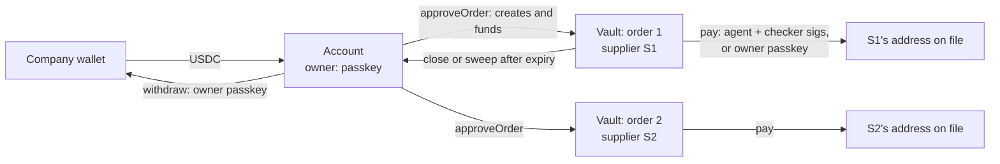

# Slice 5: The account and order vaults

## Status

**DECIDED (7 Oct 2026); plan ready, build after Spike 3.** Technical decisions made by Claude (Afshal, 7 Oct). Owner: Afshal (contracts). The vault-per-order shape depends on Spike 3's measurement; if Spike 3 shows vaults give no benefit, the vault logic moves into the account (see "If Spike 3 says otherwise").

## Goal

The core contracts: an **account** owned by a passkey that holds a company's USDC, keeps its suppliers and their addresses, and opens a **vault** for each approved order. A vault pays only that order's supplier, only at the address on file, only within what was set aside, and only with both the agent's and the checker's signatures, or with the owner's passkey for a held payment. Every rule the product promises about money lives here.

## Prerequisites

- Slices 0–4 done (Spike 4 open for apps Afshal doesn't have; nothing here depends on it).
- **Spike 3 measured** (vaults against one account) before the contract code is written. Blocked on testnet MON and USDC from the faucets.
- Testnet USDC for the testnet deployment.

## Cross-checked (7 Oct 2026)

| Source | What was checked |
|---|---|
| OpenZeppelin 5.7.0 source (installed) | `Clones`: `clone`, `cloneDeterministic`, `cloneWithImmutableArgs`, `predictDeterministicAddress`, `fetchCloneArgs`. `EIP712`: rebuilds the domain when `address(this)` differs from the template's, so each clone has its own domain with the template's name and version. `Initializable`: `initializer`, `_disableInitializers`. `ECDSA.recover` rejects malleable (high-s) signatures. `SafeERC20.safeTransfer`. `WebAuthn.verify(challenge, auth, qx, qy, requireUV)` (Slice 1) |
| Monad (Slice 3 research) | Creation priced as on Ethereum (32,000 + 200 per byte); a new storage slot costs 27,900 on its page's first touch, 17,100 after; cold account access 10,100; fees on the gas limit; conflicts per storage slot cost time, not gas |
| Circle | Testnet USDC `0x534b2f3A21130d7a60830c2Df862319e593943A3`, 6 decimals |

## Checked against earlier slices

| Slice | What it changes here |
|---|---|
| 0 | OpenZeppelin 5.7.0 and forge-std through Soldeer; solc 0.8.37 with `via_ir`; `bytecode_hash = "none"`. **Never pass a caller-supplied digest to `P256.verify`** (zero-hash forgery): owner checks go through `WebAuthn.verify`, which hashes itself. Named errors, each with a test; every external function fuzzed. CI caches dependencies |
| 1 | The owner check is `WebAuthn.verify` with **user verification required** (13.7k gas through the precompile, measured). The challenge is the 32-byte EIP-712 digest. High-s signatures are normalised by the client (ox) and refused by the encoder before sending. Passkeys from iPhone, Android and Mac all verify the same way. Synced passkeys follow the person's Apple or Google account (stated limit) |
| 2 | Not wired here: the supplier-website proof is checked by the probe's rules in Slice 15. The supplier record leaves room for a proof hash. Primus's lessons (pin every field, check age yourself) apply there |
| 3 | **Pending:** whether one vault per order beats one account, the real gas per vault and per payment, and the gas limits to hard-code (estimate + 7.5%). Payments to the same supplier conflict on its USDC balance whatever the design |
| 4 | No effect on the contracts. Pay tools will be marked destructive in the MCP server |
| Architecture | Contract surface; D13 (vault per order), D21 (evidence: the supplier record keeps when its address became active), D22 (signatures bound to vault and chain), D23 (pause; checker key replaceable while paused; withdraw while paused), D27 (the checker signs only when every code check passes: off chain, Slice 10), D28 (waiting period), D29 (first-payment cap), the stated limits |

## Design considerations

**1. Who signs what.**

| Action | Signed by | Verified as |
|---|---|---|
| Set policy, add or change a supplier, approve or close an order, withdraw, pause, unpause | Owner passkey | `WebAuthn.verify` over the EIP-712 digest of the action, in the **account's** domain; a per-account nonce and a deadline stop replay |
| Pay an invoice | Agent key **and** checker key | Two ECDSA signatures over the same EIP-712 `Payment`, in the **vault's** domain (chain ID + vault address, D22) |
| Pay a held payment once | Owner passkey | `WebAuthn.verify` over the `Payment` digest in the vault's domain |
| Record a decision (held, refused, blocked) | Checker key or owner passkey | Event only; no storage, no money |

Transactions are sent by relayers (Slice 6); signatures, not senders, carry authority. Anyone may send a correctly signed request.

**2. What a payment can never do,** whoever signs: pay an address other than the supplier's address on file; pay before that address's waiting period ends; pay more than is left in the vault, or more than the per-payment cap (lower while the address is new); pay the same invoice twice from one vault; pay while the account is paused, after the order expires or after it is closed.

**3. Vaults are clones with immutable arguments.** `approveOrder` creates the vault with `Clones.cloneDeterministicWithImmutableArgs`, carrying the account, the supplier ID, the order hash and the expiry in the clone's code, not in storage. On Monad every new storage slot costs about 27,900 gas, so only what changes is stored: the amount left, the paid invoices and the closed flag. The account funds the vault in the same transaction. The vault's template calls `_disableInitializers`; clones need no initialiser because their fixed data is immutable.

**4. The account reads, the vault writes its own storage.** A payment reads the policy, the pause flag and the supplier record from the account (reads never conflict), and writes only its own vault's storage and the token balances. No counter shared across vaults (D13). Consequence for D29 below.

**5. D29 without a shared counter.** "Lower cap for the first few payments to a new address" would need a count written by every vault, which reintroduces a shared write. Instead: **while an address is younger than `newAddressPeriod`** (e.g. 7 days after it became active), the lower `newAddressCap` applies. The same protection, decided from a timestamp the account already stores, so it stays parallel-safe. *(An adaptation of D29's mechanism, not its intent; recorded in the architecture.)*

**6. The waiting period can't be shortened in a hurry.** `setPolicy` can lower `waitingPeriod`, but a decrease takes effect only after the current waiting period has passed. Otherwise a tricked owner could set it to zero and add a fraudster's address at once (D28: "cannot be skipped").

**7. Accounts are clones too.** A factory creates each account with `cloneDeterministic`, keyed by the passkey's public key and a salt, and initialises it in the same transaction (OpenZeppelin warns that an uninitialised clone can be initialised by someone else). The address is predictable before creation, so it can be funded first.

**8. Money in and out.** The company sends USDC to its account. `approveOrder` moves an order's amount into its vault. `closeOrder` (owner) and `sweep` (anyone, after expiry) return a vault's remainder to the account, and nowhere else. `withdraw` (owner, also while paused) sends the account's unallocated USDC to an address the owner signs for.

**9. Every revert is a named error,** and every decision emits an event (`PaymentExecuted`, `DecisionRecorded`, `PolicySet`, `SupplierSet`, `OrderApproved`, `OrderClosed`, `Paused`, `Unpaused`, `Withdrawn`) for the feed, the audit record and the benchmark.

**10. If Spike 3 says otherwise.** The payment logic is written once, in an internal library, used by the vault. If vaults give no measurable benefit, the account keeps per-order state in its own storage and calls the same library; the signatures, rules and tests stay the same; only D22's domain changes from vault to account plus order ID.

## How the money moves



## State

**Account (storage):** owner passkey `(qx, qy)`; `policy` {agent key, checker key, per-payment cap, new-address cap, new-address period, waiting period, pending waiting-period decrease and when it applies, policy expiry}; `suppliers[supplierId]` {payTo, activeAfter, active, proofHash (unused until Slice 15)}; `ownerNonce`; `paused`; `vaults[orderId]`.

**Vault (immutable arguments):** account, supplierId, orderHash, expiry. **(storage):** `remaining`, `paid[invoiceHash]`, `closed`.

**`Payment` (EIP-712, vault domain):** `amount`, `invoiceHash`, `payTo`, `deadline`. The order is the vault itself; the invoice hash makes each payment unique within the vault.

## What gets built

```
contracts/
├── src/CountersignAccount.sol        owner actions, policy, suppliers, orders, pause, withdraw
├── src/OrderVault.sol                pay, payWithOwner, close, sweep
├── src/AccountFactory.sol            createAccount, predictAccount
├── src/libraries/PaymentRules.sol    the checks every payment passes (shared if Spike 3 changes the shape)
├── src/libraries/OwnerAuth.sol       EIP-712 digests and WebAuthn verification for owner actions
├── src/interfaces/*.sol
├── test/unit/*.t.sol                 one test per rule and per named error
├── test/fuzz/*.t.sol                 every external function
├── test/invariant/*.t.sol            handler-based invariants (below)
├── test/helpers/PasskeySigner.sol    signs WebAuthn assertions in tests (software P-256 key, as in Spike 1)
└── script/Deploy.s.sol               factory and templates on testnet
packages/shared/src/                  EIP-712 type definitions for Payment and each owner action (TypeScript), with tests that they hash exactly as Solidity does
```

## Tests first

**Unit (one per rule):** owner actions with a valid passkey pass; a wrong key, a used nonce, an expired deadline, a non-UV assertion, a high-s signature each fail with their named error. A payment with both signatures settles; with one, with swapped roles, with a signature for another vault, another chain or another invoice, it fails. Wrong payTo, address inside its waiting period, over the vault's remaining, over the cap, over the new-address cap, duplicate invoice, paused, expired, closed: each its own error. `payWithOwner` pays once and refuses a second time. Close and sweep return money only to the account. Withdraw works while paused. A waiting-period decrease waits.

**Fuzz:** every external function with random inputs never moves money except along the allowed paths.

**Invariants (Foundry handler):**
1. USDC leaves a vault only to its supplier's address on file or back to its account.
2. A vault never pays out more than it was funded with.
3. While paused, no vault pays.
4. No invoice hash is paid twice by one vault.
5. Account balance + all vault balances + everything paid out = everything deposited.

**TypeScript:** the EIP-712 types in `packages/shared` produce the same digests as the contracts (checked against values computed in Foundry).

## Git workflow

`feature/slice-05-contracts` off `development`; commits gated on `pnpm check`, `forge test` (with the `ci` profile) and `gitleaks git --staged`; merged only after CI passes.

## Manual testing

1. Deploy the factory and templates to testnet; create an account for a test passkey; fund it with 0.01 USDC.
2. Add Kalibre Studio's address; confirm a payment inside the waiting period is refused (`AddressNotYetActive`), using a short waiting period set for the test.
3. Approve an order of 0.005 USDC; pay 0.001 with agent and checker signatures; check the supplier received it and the vault's remaining fell.
4. Try the same invoice again: `AlreadyPaid`. Try a look-alike address: `PayToNotOnFile`.
5. Pause; a payment fails; withdraw still works; unpause.
6. Pay a held payment once with the passkey from the Slice 1 phone page.
7. Record gas for each operation, for Slice 6's hard-coded limits.

## Results (filled in after the build)

| Measure | Value |
|---|---|
| Gas: create account / approve order (create + fund vault) / pay / payWithOwner | |
| Invariant runs and depth | |

## Commit

Commits gated as above, merged into `development` after CI passes.

## Next

Slice 6: the gateway (requests, run queue, relayer pool, finality stream), using the gas figures measured here and in Spike 3.

## Decisions (made 7 Oct)

| # | Decision | Decided |
|---|---|---|
| S5-1 | Owner authority | Passkey via `WebAuthn.verify` (UV required) over EIP-712 digests, per-account nonce and deadline |
| S5-2 | Payment authority | Agent and checker ECDSA signatures over the vault-domain `Payment`; or the owner's passkey for a held payment |
| S5-3 | Vault shape | Clone with immutable arguments; only remaining, paid invoices and closed in storage. Revisited if Spike 3 says so |
| S5-4 | D29 mechanism | Lower cap while an address is younger than `newAddressPeriod` (parallel-safe), instead of a payment count |
| S5-5 | Lowering the waiting period | Takes effect only after the current waiting period |
| S5-6 | Accounts | Deterministic clones from a factory, initialised in the same transaction |

---

