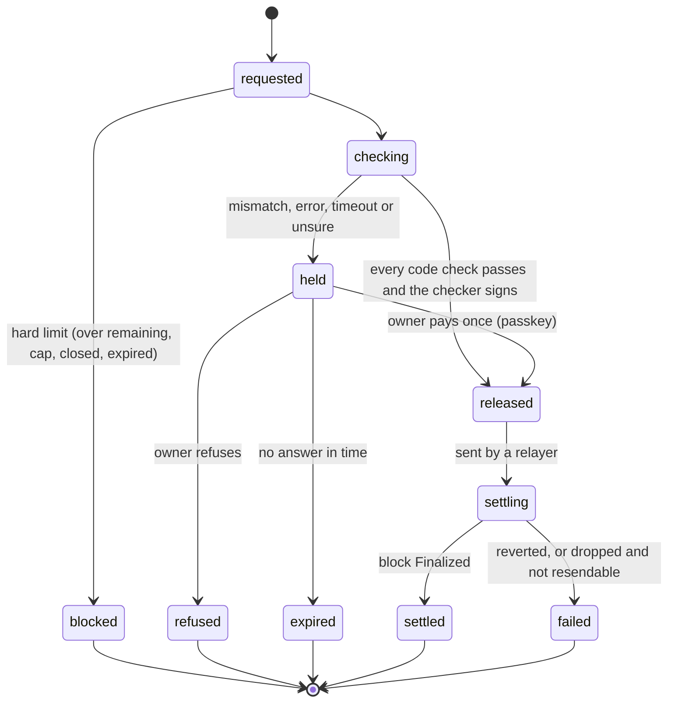

# Slice 6: The gateway

## Status

**DECIDED (7 Oct 2026); plan ready, build after Slice 5.** Technical decisions made by Claude. Owner: Afshal (gateway, D6).

## Goal

The always-running service between agents and the chain. It takes a payment request or a whole run of invoices, gives each a stable ID so retries and duplicate agents get the same answer, asks the checker, sends released payments through a pool of relayer wallets, follows each transaction to **Finalized** on Monad, and records every step. Every request ends in exactly one final status, even after a crash. The MCP server (Slice 12), the approver app (Slice 11) and the run board (Slice 16) all talk to it.

## Prerequisites

- Slice 5 built (done 7 Oct): contract ABIs, the EIP-712 types in `packages/shared` (`ownerActionTypes`, `paymentTypes`, `decisionTypes`, `accountDomain`, `vaultDomain`), factory `0x094250cCC1dDBd8530e4FC9A1C900db3D0D9EB5f` on testnet, and measured gas per operation.
- Spike 3's measurements (done 7 Oct, S3-7 and S3-8): ordered sending with failover, pool size, one-transaction funding, gas per payment. The spike's nonce allocator, stage tracker, pacer, failover lanes and funding rule are rewritten here as product code with their tests (spike code is never imported).
- A Railway project with Postgres (Afshal has an account).

## Cross-checked (7 Oct 2026)

| Source | What was checked |
|---|---|
| Context7 `/websites/hono_dev` | `serve` from `@hono/node-server`; `zValidator` from `@hono/zod-validator`; `bearerAuth` from `hono/bearer-auth`; graceful shutdown on SIGTERM |
| Context7 `/drizzle-team/drizzle-orm-docs` | `db.transaction` with isolation levels; `onConflictDoNothing` / `onConflictDoUpdate` for idempotent inserts. Row locking (`FOR UPDATE SKIP LOCKED`) is not in these docs: confirmed in the installed package at build time, raw `sql` as fallback |
| viem 2.57.3 source | The webSocket transport's `subscribe({ params, onData, onError })` sends `eth_subscribe` with any params, so `['monadNewHeads']` works (cast needed; types list only standard ones). Reconnect on by default |
| npm (all at least a day old) | hono 4.13.13, @hono/node-server 2.1.3, @hono/zod-validator 0.9.1, drizzle-orm 0.45.3, drizzle-kit 0.31.11, pg 8.23.1, @types/pg 8.23.1 |
| Monad (Slice 3 research and Spike 3 runs) | Finality 600 ms (`finalized` tag; `monadNewHeads` carries `Proposed`, `Voted`, `Finalized` and `Verified` with a `blockId`); no per-sender pending limit; in-flight gas per wallet ≤ min(10 MON, balance); **nonce gaps are documented as held, but out-of-order nonces across nodes were lost in Spike 3**; replacement needs a strictly higher fee; pending transactions invisible to `eth_getTransactionByHash` (use `txpool_statusByHash`); public RPC 50 req/s, `eth_call` 15 a second (measured), batches give no extra throughput; `eth_getLogs` capped at 100 blocks; reserve balance: under 10 MON, one MON transfer out per 3 blocks |

## Checked against earlier slices

| Slice | What it changes here |
|---|---|
| 0 | Settings through the fail-closed loader (RPC URLs, relayer keys, database URL, service tokens); Node 24, TypeScript 6.0.3; gated commits; versions at least a day old (pnpm's release-age rule) |
| 1 | Slice 1 measured 1.0–1.4 s to finalized by **polling**; the gateway follows `monadNewHeads` instead and records each stage's time. Gas limit: estimate + 7.5% or hard-coded (Slice 1 used +20%, corrected). Explorer links: MonadVision |
| 2 | Long-running clients get time limits and explicit shutdown (Primus's SDK hung). The supplier proof is not checked here |
| 3 | **Measured (vault run, 7 Oct):** 200 payments through 8 wallets in 5.4 s, of which 4.4 s was sending; 0.95 s per payment from send to finalized. Changes here: ordered sending per wallet, one endpoint per wallet (out-of-order nonces were lost, not held); relayers funded in one Multicall3 transaction (reserve balance); results read with `eth_getBlockReceipts` per finalized block; `eth_call` limited to 15 a second, so reads are paced; about 0.018 MON per payment, so a wallet's float is sized from that. Duplicates must be caught **before** sending, because a refused transaction pays its whole gas limit. 4 wallets: 11.4 s for 200. An endpoint can accept and drop transactions (monadinfra, twice), so the gateway fails over between endpoints. Vaults were not faster than one account (S3-7), so the gateway claims speed from finality and the pool, not from vaults |
| 4 | The MCP server on Vercel calls the gateway over HTTPS with a service token. Tools never wait on a person: a held result returns at once with the approval link, and agents check back with `payment_status` |
| 5 | **Built (7 Oct):** payments are the vault-domain `Payment` (amount, invoice hash, payTo, deadline); each invoice hash pays once per vault; `payWithOwner` for held payments; `recordDecision` (checker) and `recordDecisionByOwner` (passkey); events (`PaymentExecuted`, `DecisionRecorded`) read from receipts, not log scans. Every refusal is a named error the gateway maps to a typed reason. **Gas on Monad:** `pay` 246k execution (limit about 266k), `payWithOwner` 214k, `recordDecision` 87k, `approveOrder` 274k, so a payment costs about 0.027 MON and a relayer's float is sized from that, not from Spike 3's 0.018. Simulate each payment before sending (an `eth_call` refuses with the named error for free) |
| Architecture | The state of a payment request (statuses, typed reasons, `decidedBy`, evidence, timings recorded separately), D15 (batch runs), D16 (parallel checks under a cap; code checks first), D17 (public endpoints, with wallets spread across them and failover between them, instead of a free private RPC), D18 (holds grouped by reason), D27 (the checker signs only when every code check passes), money rules 1, 4 and 5 |

## Design considerations

**1. One request, one ID, one final status.** A request's ID is derived from the account, the vault and the invoice hash. The `payment_requests` table has a unique key on it, so a second submission (a retry, or a second agent) returns the existing request and its current status instead of creating another. Status changes are rows in `payment_events`, written in the same database transaction as the status update, so the history and the current state never disagree.

**2. The state machine.**



**3. Runs.** `POST /v1/runs` takes many invoices at once and returns a run ID; each invoice becomes a request in the run. Workers claim requests with `SELECT … FOR UPDATE SKIP LOCKED`, so several workers never take the same one. Checks run in parallel under a cap sized to the checker's rate limit (D16).

**4. The checker is behind an interface.** Until Slice 10, a test double decides; the gateway never signs as the checker (the checker key lives only in the checker service). The gateway's call to the checker has its own total time limit, 2 s (above the checker's 1.5 s for Jev), and no answer in time is a hold (money rule 1).

**5. Relayer pool.** N wallets (keys in `RELAYER_PRIVATE_KEYS`), each with its nonce tracked in Postgres, so a restart resumes correctly. Each wallet's in-flight gas is kept within min(10 MON, its balance), Monad's reserve rule, and a low balance raises an alert. Gas limits are hard-coded per operation from Slice 5's measurements (estimate plus 7.5%; receipts report the limit as `gasUsed`, so execution gas comes from estimates).

**Ordered sending (Spike 3, finding 4).** Each wallet keeps to one endpoint and sends its next nonce only after the endpoint has accepted the previous one; wallets, not transactions, are spread across the endpoints. Spreading one wallet's transactions lost every one that reached a node ahead of an earlier nonce. So the pool's size sets a run's speed: each wallet sends about 6 to 10 a second (acceptance takes about 130 ms), and 8 wallets sent 200 in 4.4 s. **Failover (Spike 3, finding 8):** an endpoint can accept transactions and never forward them, and re-sending to it does not help. Each wallet is a lane: if its lowest pending nonce is not finalized 3 s after acceptance (p95 is about 1.2 s), the lane moves to the next endpoint, re-sends its pending transactions in nonce order, and the old endpoint is set aside for 30 s. A stuck transaction that is still known to the pool (`txpool_statusByHash`, Monad's endpoint or monadinfra; Ankr refuses it) is replaced with a strictly higher fee. **Pool size (finding 10):** one wallet sends about 6 to 10 a second, so 200 payments took 11.4 s through 4 wallets and 5.4 s through 8; the public endpoints cap the pool at roughly 70 a second, so the gateway starts with 8 to 12 wallets.

**Funding the pool (Spike 3, finding 5).** Below 10 MON an account may move MON out only once per 3 blocks, so the treasury tops up every relayer in one Multicall3 `aggregate3Value` transaction, then waits 3 blocks before the relayers send (their gas budget uses the balance from 3 blocks earlier).

**6. Finality.** One websocket subscription to `monadNewHeads` follows every block's stage. A request becomes `settled` only when its block is **Finalized** (money rule 4); `proposed` and `voted` are shown, never acted on. If the websocket drops, the gateway polls the `finalized` tag until it reconnects. Receipts, not log scans, carry the contract's events.

**7. Crash recovery.** On start, the gateway finds every request in `checking`, `released` or `settling` and resumes it: re-asks the checker, re-sends with the recorded nonce, or re-checks the transaction. No request stays in the middle.

**8. Feed.** A Server-Sent Events endpoint streams status changes for the approver app and the run board.

**9. Access.** Service tokens for the MCP server and the apps (`GATEWAY_SERVICE_TOKEN`); per-account sign-in comes in Slice 13. The gateway never holds an owner key; it holds the relayer keys and, in hosted mode, the agent key; never the checker key.

**10. Hosting.** Railway: one service from `services/gateway`, Railway Postgres on its private network, migrations with drizzle-kit on deploy, a health endpoint, graceful shutdown on SIGTERM.

## API

| Method | Path | Purpose |
|---|---|---|
| POST | `/v1/payments` | Submit one invoice payment; returns the request with its status |
| POST | `/v1/runs` | Submit many; returns a run ID |
| GET | `/v1/payments/:id`, `/v1/runs/:id` | Status, reason, evidence, transaction and timings |
| POST | `/v1/payments/:id/approve` | Owner's passkey assertion for `payWithOwner` |
| POST | `/v1/payments/:id/refuse` | Owner's passkey refusal; ends the agent's run |
| GET | `/v1/feed` | Server-Sent Events of status changes |
| GET | `/health` | Database, websocket and relayer balances |

All bodies are validated with zod; errors are typed (`malformed`, `unknown_request`, …), never a stack trace.

## What gets built

```
services/gateway/
├── src/app.ts               Hono routes, validation, auth
├── src/db/schema.ts         payment_requests, payment_events, runs, relayer_nonces
├── src/state.ts (+ test)    the state machine: allowed transitions, typed reasons
├── src/ids.ts (+ test)      request IDs
├── src/queue.ts (+ test)    claiming work (SKIP LOCKED), concurrency caps
├── src/relayers.ts (+ test) nonce allocation, in-flight gas budget, resend and replace
├── src/finality.ts (+ test) monadNewHeads tracking, polling fallback
├── src/checker.ts           the checker interface and its test double
├── src/recovery.ts (+ test) resuming interrupted requests on start
├── src/feed.ts              Server-Sent Events
└── drizzle/                 migrations
packages/chain/              viem clients, ABIs, Monad config shared with other services
```

## Tests first

**Unit:** every allowed state transition passes and every other is refused; the same submission twice returns the same request; nonces stay consecutive per wallet and a failed send reuses its nonce; the in-flight budget refuses to over-commit a wallet; recorded `monadNewHeads` messages (fixtures captured from testnet) move a request to `settled` only at Finalized; recovery resumes each interrupted state correctly.

**Integration (real Postgres: a service container in CI; Docker locally):** two workers never claim the same request; a crash between "sent" and "recorded" is recovered without double-sending; a run of 200 with a test checker reaches 200 final statuses.

**Testnet (manual):** a run against Slice 5's deployed contracts (below).

## Git workflow

`feature/slice-06-gateway` off `development`; commits gated on `pnpm check` and `gitleaks git --staged`; merged only after CI passes (CI gains a Postgres service container).

## Manual testing

1. Deploy to Railway with Postgres; `/health` shows the database, the websocket and every relayer's balance.
2. Submit one clean payment with the test checker: `settled`, with proposed, voted and finalized times recorded.
3. Submit the same invoice again: the same request comes back; no second transaction.
4. Submit a run of 50: all reach a final status; the feed streams each change.
5. Kill the service mid-run and restart it: every request still reaches exactly one final status, and no invoice is paid twice.
6. Hold one (test checker says no), approve it with the passkey: `settled` through `payWithOwner`.

## Results (filled in after the build)

| Measure | Value |
|---|---|
| One payment: request to finalized | |
| Run of 50 / 200: first request to last finalized | |
| Crash test: requests recovered, double-sends | |

## Commit

Gated commits, merged into `development` after CI passes.

## Next

Slice 7: the supplier portal and demo shop, with the clean and doctored documents.

## Decisions (made 7 Oct)

| # | Decision | Decided |
|---|---|---|
| S6-1 | Stack | Hono on Node, on Railway; Postgres on Railway with Drizzle and node-postgres |
| S6-2 | Queue | In Postgres with `SKIP LOCKED`; no Redis or separate queue service |
| S6-3 | Finality | `monadNewHeads` websocket, polling fallback; settled only at Finalized |
| S6-4 | Relayers | 8 to 12 wallets (Spike 3: about 6 to 10 sends a second each); ordered sending, one endpoint per wallet, failover after 3 s; funded in one Multicall3 transaction; nonces tracked in Postgres |
| S6-5 | Service access | A service token now; per-account sign-in in Slice 13 |
| S6-6 | Live updates | Server-Sent Events |
| S6-7 | Checker | An interface with a test double until Slice 10 |

